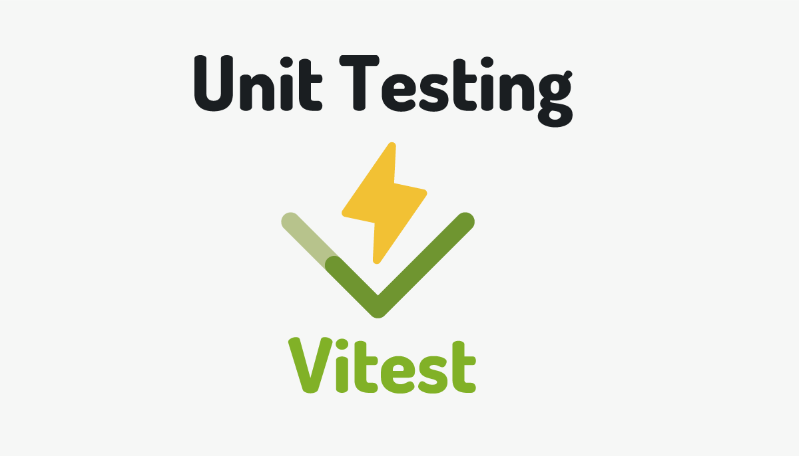

# Apprendre les tests unitaires en JavaScript avec Vitest



## Objectifs du TP

1. Comprendre l'importance des tests unitaires dans le développement logiciel.
2. Apprendre à écrire des tests unitaires en JavaScript.
3. Maîtriser l'utilisation de Vitest pour l'exécution des tests unitaires.

## Durée estimée

3 heures

## Plan du TP

1. Introduction aux tests unitaires
    - Définition des tests unitaires.
    - Avantages des tests unitaires dans le développement logiciel.


2. Présentation de Vitest
    - Présentation de Vitest : Qu'est-ce que c'est et pourquoi l'utiliser ?
    - Installation de Vitest dans un projet JavaScript.

3. Écriture de tests unitaires avec Vitest
    - Structure des tests avec Vitest.
    - Écriture de tests simples pour les fonctions JavaScript.
    - Utilisation des assertions pour vérifier les résultats attendus.
    - Gestion des fonctions asynchrones
    - Techniques avancées d'écriture de tests avec Vitest

4. Techniques avancées d'écriture de tests avec Vitest
    - Utilisation des mocks 

## Introduction aux tests unitaires
### Définition des tests unitaires
- Les tests unitaires sont des procédures pour vérifier si une unité de code (fonction, méthode, classe) fonctionne correctement.
- Objectif principal : isoler et tester chaque composant de manière indépendante.

### Concepts de base des tests unitaires
1. Compréhension de l'unité de test
    - Une unité de test est la plus petite partie testable d'une application.
    - Elle devrait être simple, isolée et indépendante des autres parties du code.

2. Principes fondamentaux des tests unitaires
    - F.I.R.S.T. : Les tests unitaires doivent être Fast, Isolated, Repeatable, Self-validating et Timely.
    - Test Driven Development (TDD) : Une approche de développement où les tests unitaires sont écrits avant le code de production.

3. Différence entre les tests unitaires et les autres types de tests
    - Tests d'intégration : Testent les interactions entre les différentes parties d'une application.
    - Tests système : Testent l'application dans son ensemble pour s'assurer qu'elle fonctionne comme prévu.

4. Outils couramment utilisés pour les tests unitaires
    - Frameworks de tests : Jest, Mocha, Jasmine, etc.
    - Bibliothèques d'assertions : Chai, Assert, etc.
    - Outils de mocking : Sinon, Mockito, etc.
### Avantages des tests unitaires dans le développement logiciel
- Réduction des bugs : Les tests unitaires permettent de détecter et corriger les erreurs dès leur apparition.
- Facilitation de la maintenance : En fournissant une rétroaction rapide sur les changements de code, les tests unitaires rendent la maintenance plus efficace.
- Amélioration de la conception : Les tests unitaires encouragent une conception modulaire et une meilleure séparation des préoccupations.
- Accélération du développement : En automatisant les tests, les développeurs gagnent du temps et peuvent se concentrer sur de nouvelles fonctionnalités.

### Objectifs des tests unitaires
- Assurer la fonctionnalité attendue de chaque composant individuel.
- Réduire les risques lors des modifications ou des ajouts de fonctionnalités.
- Fournir une documentation vivante du comportement attendu du code.


## Présentation de Vitest
1. Introduction à Vitest : qu'est-ce que c'est ?
    - Vitest est un framework de tests unitaires pour JavaScript.
    - Il offre une syntaxe simple et expressive pour écrire des tests unitaires.

2. Raisons d'utiliser Vitest pour les tests unitaires
    - Facilité d'utilisation : Vitest est facile à apprendre et à utiliser pour les développeurs JavaScript.
    - Performance : Vitest offre des performances élevées pour l'exécution des tests unitaires.

3. Caractéristiques principales de Vitest
    - Syntaxe intuitive : Les tests unitaires avec Vitest sont écrits de manière déclarative et facile à comprendre.
    - Support des promesses : Vitest prend en charge les tests asynchrones avec des promesses.
    - Comparaison avec Jest, Mocha, Jasmine, etc.
    - Points forts et faiblesses de Vitest par rapport aux autres frameworks.

4. Installation de Vitest dans un projet JavaScript

    a. Prérequis pour installer Vitest

    - Node.js installé sur le système
    - Un projet JavaScript existant ou nouvellement créé


    b. Installation de Vitest via npm

        npm install -D vitest
        

    c. Configuration de Vitest dans un projet JavaScript

    Une fois que vous avez installé Vitest dans votre projet JavaScript, vous devez le configurer correctement pour qu'il fonctionne efficacement. Voici les étapes de configuration :

    - Configuration initiale de Vitest dans le fichier de configuration du projet.

    Dans le fichier **package.json** ajouter la configuration suivante:
                ```json

                    {
                "scripts": {
                    "test": "vitest"
                }
                }
                ```

    - Spécification des répertoires de tests et de leur structure.
    Il est important de spécifier les répertoires où se trouvent vos tests ainsi que leur structure. Vitest suit généralement une convention de structuration des tests pour faciliter l'organisation et l'exécution des tests. Assurez-vous de respecter cette convention pour que Vitest puisse découvrir et exécuter vos tests correctement.

    Par exemple, vous pourriez organiser vos tests dans un répertoire tests à la racine de votre projet, avec des sous-répertoires pour chaque module ou composant, et des fichiers de test portant le même nom que les fichiers qu'ils testent.


            project/
        ├── src/
        │ ├── module1.js
        │ └── module2.js
        └── tests/
        ├── module1.test.js
        └── module2.test.js

## Écriture de tests unitaires en JavaScript avec Vitest

Dans cette partie, nous allons plonger dans l'écriture de tests unitaires en JavaScript en utilisant Vitest. Nous allons commencer par comprendre la structure de base des tests avec Vitest, puis nous allons écrire des tests simples pour des fonctions JavaScript, en utilisant des assertions pour vérifier les résultats attendus.

### Structure des tests avec Vitest

Vitest propose une structure simple et claire pour l'écriture des tests unitaires. Voici un exemple de structure de test avec Vitest :

```javascript
import { test } from 'vitest';

test('Nom du test', () => {
  // Corps du test
});
```

Dans cet exemple, nous utilisons la fonction test fournie par Vitest pour définir un nouveau test. À l'intérieur de la fonction test, nous spécifions le nom du test et le corps du test, où nous effectuons nos vérifications.

### Écriture de tests simples

Voyons maintenant comment écrire des tests simples pour des fonctions JavaScript. Supposons que nous ayons une fonction add qui additionne deux nombres. Voici comment nous pourrions écrire un test pour cette fonction :

```javascript
import { test } from 'vitest';
import { add } from './math'; // Supposons que 'add' est une fonction exportée depuis un fichier 'math.js'

test('Test de la fonction add', () => {
  const result = add(2, 3);
  expect(result).toBe(5);
});
```
!!! Activité-1

    1. Créer un nouveau projet TP1 avec votre IDE préféré

    2. Créer un fichier `math.js` dans lequel ajouter une fonction `add` qui calcule la somme de deux entiers.

    3. Créer un dossier `test`, sous lequel créer un fichier que vous nommez `math.test.js`.

    4. Suivre les étapes mentionnées dans la section 2 pour installer Vitest.

    5. Modifier le fichier package.json pour ajouter la section "scripts", Ajoutez la section "scripts" dans votre fichier package.json comme suit :

        ```json
        "scripts": {
        "dev": "vite",
        "build": "vite build",
        "preview": "vite preview",
        "test": "vitest"}
        ```


    6. Copier le code ci-dessus pour tester la fonction `add`.

    7. Exécuter le test avec la commande `npm run test`
### Utilisation des assertions pour vérifier les résultats attendus.

Vitest utilise des assertions pour vérifier si le comportement attendu est respecté par le code testé. Voici quelques-unes des assertions les plus couramment utilisées :

- **`expect(value).toBe(expected)`**: Vérifie si `value` est strictement égal à `expected`.
- **`expect(value).toEqual(expected)`**: Vérifie si `value` est égal à `expected` en effectuant une comparaison en profondeur pour les objets et les tableaux.
- **`expect(value).toBeTruthy()`**: Vérifie si `value` est évalué à `true`.
- **`expect(value).toBeFalsy()`**: Vérifie si `value` est évalué à `false`.
- **`expect(value).toContain(expected)`**: Vérifie si `value` contient `expected` (pour les chaînes de caractères et les tableaux).

!!! note

    Visitez [ce lien](https://www.chaijs.com/api/bdd/) pour plus de détails sur les assertions.

#### Exercice 1
##### Objectif
Écrire des tests unitaires pour une fonction de manipulation de chaînes.

##### Description
La tâche consiste à écrire des tests unitaires pour une fonction de manipulation de chaînes implémentée en JavaScript. La fonction prendra une chaîne de caractères en entrée et effectuera une opération de transformation sur cette chaîne.

!!! Activité
    1. Implémentez la fonction transformer qui transforme une chaine de caractères en Majuscule.
    2. Écrivez au moins trois cas de tests unitaires pour la fonction transformer. Assurez-vous de tester les cas suivants :

        - Une chaîne vide.
        - Une chaîne avec des caractères en minuscules.
        - Une chaîne avec des caractères spéciaux.

    3. Utilisez différentes assertions pour vérifier si la fonction transformer renvoie la chaîne transformée correctement.
    4. Assurez-vous que vos tests couvrent tous les cas de figure possibles pour garantir que la fonction de manipulation de chaînes fonctionne correctement dans diverses situations

#### Exercice 2
##### Objectif
Écrire des tests unitaires pour une fonction de tri.
##### Description
La tâche consiste à écrire des tests unitaires pour une fonction de tri implémentée en JavaScript. La fonction de tri prendra un tableau de nombres en entrée et triera ces nombres par ordre croissant.

!!! Activité

    1. Implémentez la fonction trier en JS.
    2. Ecrivez au moins 3 cas de test.
    3. Utilisez des assertions pour vérifier si la fonction trier renvoie le tableau trié correctement.
    4. Assurez-vous que vos tests couvrent tous les cas de figure possibles, y compris les tableaux déjà triés, les tableaux inversés, etc.
    5. Assurez-vous de tester également les cas limites et les situations d'erreur potentielles, comme les tableaux avec des éléments non numériques.

#### Exercice 3
##### Objectif
Test au valeurs limites : Boundary testing.
##### Description
La fonction isPriceInRange(price, min, max) vérifie si un prix donné se situe dans une plage donnée.

```js
export function isPriceInRange(price, min, max) {
  return price >= min && price <= max;
}
```

!!! Activité

    Écrivez des cas de test pour cette fonction en couvrant les limites de la plage ainsi que les cas où le prix est en dehors de la plage.

### Gestion des fonctions asynchrones
Les fonctions asynchrones peuvent retourner des promesses ou utiliser des rappels (callbacks) pour indiquer la fin de leur exécution. Lorsque vous testez de telles fonctions, vous devez vous assurer que vos tests attendent la fin de l'exécution de ces fonctions avant de vérifier les résultats. Vitest facilite cette attente en vous permettant d'utiliser les mots-clés await ou done pour gérer l'asynchronisme dans vos tests.
#### Utilisation d'await
Lorsque vous testez des fonctions asynchrones avec Vitest, vous pouvez utiliser le mot-clé **await** pour attendre la résolution ou le rejet des promesses retournées par ces fonctions. Cela vous permet d'exécuter des assertions une fois que la promesse est résolue ou rejetée, garantissant ainsi que votre test est exécuté dans le bon ordre et que les résultats attendus sont correctement vérifiés.
#### Gestion des erreurs
Les fonctions asynchrones peuvent générer des erreurs pendant leur exécution, et il est important de les gérer correctement dans vos tests. Vitest vous permet d'utiliser les blocs **try/catch** pour capturer et traiter les erreurs potentielles générées par les fonctions asynchrones lors de l'exécution de vos tests.
#### Attente explicite
Dans certains cas, vous devrez peut-être attendre un certain délai avant de vérifier les résultats d'une fonction asynchrone. Vitest fournit des méthodes pour gérer cette attente explicite, comme **setTimeout** ou **setImmediate**, pour s'assurer que votre test donne suffisamment de temps à la fonction asynchrone pour terminer son exécution avant de procéder à la vérification.
#### Exemple
Supposons que nous avons une fonction asynchrone fetchData() qui effectue une requête HTTP pour récupérer des données d'un serveur distant. Nous voulons tester cette fonction pour nous assurer qu'elle renvoie les données attendues.

```js
export async function fetchData() {
  const response = await fetch('https://api.example.com/data');
  if (!response.ok) {
    throw new Error('Failed to fetch data');
  }
  const data = await response.json();
  return data;
}
```

Voici comment nous pouvons écrire un test pour cette fonction avec Vitest :

```js
import { fetchData } from './fetchData'; // Import de la fonction à tester

describe('fetchData()', () => {
  it('should fetch data from the server', async () => {
    try {
      const data = await fetchData(); // Appel de la fonction asynchrone
      // Vérification des résultats attendus
      expect(data).toBeDefined(); // On s'assure que les données ont été renvoyées
      expect(Array.isArray(data)).toBe(true); // On vérifie que les données renvoyées sont un tableau
      // Ajoutez d'autres assertions selon les données attendues
    } catch (error) {
      // Si une erreur se produit pendant l'exécution de la fonction asynchrone
      // On signale le test comme échoué
      fail('Should not throw any error');
    }
  });
});
```
Dans cet exemple :

Nous utilisons **async** dans la fonction de test pour indiquer que le test est asynchrone et qu'il utilise **await** pour attendre la résolution de la promesse retournée par fetchData().
Nous appelons la fonction fetchData() à l'intérieur du bloc **try/catch** pour capturer toute erreur potentielle qui pourrait survenir lors de son exécution.
Dans le bloc try, nous effectuons des assertions sur les données renvoyées par la fonction fetchData() pour nous assurer qu'elles correspondent à ce que nous attendons.
Si une erreur survient pendant l'exécution de la fonction asynchrone (par exemple, une erreur de réseau ou une erreur de syntaxe), elle sera capturée dans le bloc catch et le test sera signalé comme un échec en utilisant **fail()**.
#### Exercice

##### Objectif
Implémenter un test pour une fonction asynchrone qui récupère des données d'une API.

##### Description
Nous avons une fonction asynchrone appelée fetchRandomUser() qui récupère les données d'un utilisateur aléatoire à partir de l'API "Random User Generator". L'objectif de l'exercice est d'écrire un test pour cette fonction pour vérifier si elle renvoie les données attendues de manière asynchrone.
```js
export async function fetchRandomUser() {
  const response = await fetch('https://randomuser.me/api/');
  if (!response.ok) {
    throw new Error('Failed to fetch random user');
  }
  const data = await response.json();
  return data.results[0]; // Renvoie les informations sur le premier utilisateur dans la liste
}
```

!!! Activité
    1.Comprendre la fonction à tester :

    La fonction fetchRandomUser() utilise l'API "Random User Generator" pour récupérer les données d'un utilisateur aléatoire.
    Elle renvoie un objet JSON contenant des informations sur cet utilisateur.

    2.Écrire le test :

    Utilisez Vitest pour écrire un test pour la fonction fetchRandomUser().
    Assurez-vous d'attendre de manière asynchrone la résolution de la promesse retournée par la fonction.
    Vérifiez que les données renvoyées sont bien un objet JSON contenant les informations sur l'utilisateur.

### Couverture de code

Pour la couverture de code, c’est-à-dire la vérification du taux de code couvert par les tests unitaires – un indicateur de qualité de logiciel de plus en plus présent dans les projets – il suffit d’ajouter l’option **--coverage** à l’appel du test, par exemple dans votre fichier package.json :

        "scripts": {
        "dev": "vite",
        "build": "vite build",
        "preview": "vite preview",
        "test:coverage": "vitest --coverage"}

Ensuite, vous pouvez lancer la couverture de code avec : **npm run test:coverage**


## Travail à rendre 
!!! Exercice
    Choisir un projet, qu'il soit personnel ou open-source, puis créez au moins trois tests unitaires pour ce projet. Ensuite, exécuter ces tests en incluant le calcul de la couverture de code.