# Test de bout en bout avec Selenium

## Objectifs du TP

1. Comprendre l'importance des tests de bout en bout le développement logiciel.
2. Apprendre à utiliser Selenium IDE pour l'automatisation des tests.
3. Créer et exécuter des tests sur des applications web.

## Durée estimée

3 heures

## Plan du TP

1. Introduction aux tests de bout en bout ( end to end testing E2E)

2. Présentation de Selenium
    - Selenium IDE : qu'est-ce que c'est et comment ça fonctionne.
    - Présentation de l'interface utilisateur de Selenium IDE
    - Installation de Selenium IDE.

3. Création de tests simples
  

4. Analyse et débogage des tests

## Introduction aux tests de bout en bout

Les tests de bout en bout sont une approche de test logiciel qui vise à vérifier le bon fonctionnement d'une application dans son ensemble, en simulant le parcours complet de l'utilisateur, de l'interface utilisateur à la base de données. Ces tests reproduisent les actions réelles que les utilisateurs effectueraient, en s'assurant que toutes les parties de l'application fonctionnent correctement ensemble.

  1. Objectif des tests de bout en bout :

    Les tests E2E visent à garantir que toutes les fonctionnalités d'une application fonctionnent correctement ensemble, de manière intégrée. Ils permettent de valider le flux complet de l'application, en testant chaque étape du processus utilisateur, de l'interaction avec l'interface utilisateur à la manipulation des données dans la base de données.

  2. Portée des tests de bout en bout :

    Les tests de bout en bout couvrent l'ensemble de l'application, y compris l'interface utilisateur, les interactions avec les composants backend, les services, les bases de données, etc. Ils sont généralement réalisés dans un environnement similaire à celui de la production pour garantir une validation réaliste du comportement de l'application.

  3. Outils pour les tests de bout en bout :

    Plusieurs outils sont disponibles pour automatiser les tests de bout en bout. Parmi les plus populaires figurent Selenium, Puppeteer, Cypress, TestCafe, etc. Ces outils offrent des fonctionnalités pour simuler les interactions utilisateur sur le navigateur, effectuer des assertions sur les éléments de l'interface utilisateur et exécuter des tests dans un environnement contrôlé.

  4. Avantages des tests de bout en bout :

    - Détection précoce des problèmes : Les tests E2E permettent de détecter les problèmes d'intégration entre les différents composants de l'application dès les premiers stades du développement.

    - Validation complète de l'application : Ils garantissent que toutes les fonctionnalités de l'application fonctionnent correctement ensemble, offrant ainsi une meilleure qualité globale.
    - Automatisation des scénarios complexes : Les tests E2E permettent d'automatiser des scénarios utilisateur complexes, réduisant ainsi le temps nécessaire pour effectuer des tests manuels répétitifs.

## Présentation de Selenium
1. Introduction à Selenium : qu'est-ce que c'est ?

 Selenium est un outil de test automatisé largement utilisé pour automatiser les tests fonctionnels de sites Web. Il permet aux développeurs et aux testeurs de créer des scripts de test dans divers langages de programmation tels que Java, Python, C#, etc., pour simuler les interactions utilisateur sur un navigateur web.

2. Selenium IDE : qu'est-ce que c'est et comment ça fonctionne.

    * Présentation de Selenium IDE

Selenium IDE est un environnement de développement intégré (IDE) pour Selenium, un ensemble d'outils d'automatisation de tests largement utilisés dans le domaine du développement logiciel. Conçu spécifiquement pour les applications web, Selenium IDE permet aux testeurs et aux développeurs de créer, de modifier et d'exécuter des tests automatisés de manière intuitive et efficace. Avec Selenium IDE, les utilisateurs peuvent enregistrer des interactions utilisateur, telles que les clics de souris, la saisie de texte et la navigation sur les pages web, et générer du code de test automatisé qui peut être exécuté pour vérifier le bon fonctionnement de l'application web sous test.

    
   * Fonctionnement de Selenium IDE

Selenium IDE fonctionne comme une extension de navigateur pour Google Chrome et Mozilla Firefox. Une fois installé dans le navigateur, Selenium IDE offre une interface conviviale qui permet aux utilisateurs d'enregistrer des scénarios de test en effectuant des actions directement dans le navigateur. Par exemple, un testeur peut ouvrir une page web, cliquer sur différents éléments de l'interface utilisateur, saisir du texte dans les champs de formulaire, soumettre des formulaires, etc. Pendant l'enregistrement, Selenium IDE capture ces interactions et génère automatiquement du code de test basé sur les actions de l'utilisateur. Une fois l'enregistrement terminé, les utilisateurs peuvent modifier le code de test généré pour l'adapter à leurs besoins spécifiques, en ajoutant des validations, des boucles, des conditions, etc. Enfin, les tests peuvent être exécutés à tout moment à l'aide de Selenium IDE, ce qui permet de vérifier automatiquement le bon fonctionnement de l'application web sous test.

3. Présentation de l'interface utilisateur de Selenium IDE

Selenium IDE se présente comme suit :
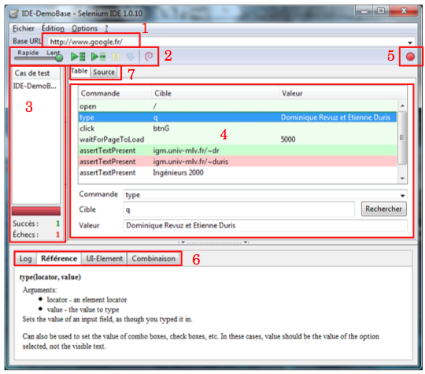

  1.  URL racine de l'interface web à tester
  2.  Barre d'outils de débug (point de départ, point d'arrêt, lecture pas à pas, ...)
  3.  Liste des suites de tests ouvertes
  4.  Fonctions appelées et paramètres
  5.  Bouton d'enregistrement des interractions de l'utilisateur. En appuyant dessus, toutes les actions de l'utilisateur dans l'interface web seront automatiquement enregistrées et apparaitront dans l'encadré n°4
  6.  Log(log des fonctions appelées / Référence(documentation des fonctions) / UI-Element (rarement rempli contient des informations en plus de l'onglet référence) / Combinaison
  7.  Onglet Table/Source. (actuellement visible : Table). L'onglet Source est détaillé plus bas.

Nous pouvons constater que le choix de la cible se fait de manière intelligente :
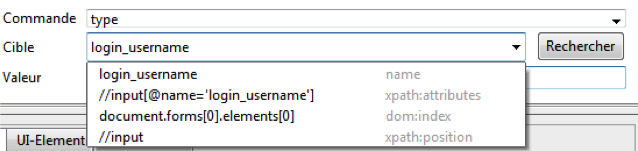

Si nous enregistrons un texte avec le bouton d'enregistrement, alors selenium IDE nous propose tout les choix possible pour l'identification du champs : son ID, son name attribute, son Xpath, etc...

4. Installation de Selenium IDE

Pour installer Selenium IDE sur Google Chrome, ajoutez l'extension de Selenium IDE dans le navigateur web. Suivez les étapes ci-dessous :

  - Ouvrez le navigateur Google Chrome sur votre système, puis rendez-vous sur le lien. Cela vous dirigera vers le Chrome Web Store où vous devrez ajouter l'extension de Selenium IDE à votre navigateur Chrome. Cliquez sur le bouton "Ajouter à Chrome".

  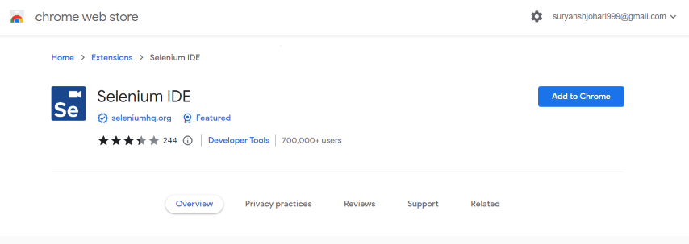

  - Lorsque vous cliquez sur le bouton "Ajouter à Chrome", une boîte de dialogue d'avertissement apparaîtra à l'écran. Cliquez simplement sur le bouton "Ajouter l'extension" pour finalement ajouter l'extension à votre navigateur Chrome.

  - Maintenant, vous devez cliquer sur l'icône de l'extension dans le navigateur Google Chrome, située dans le coin supérieur droit. Une liste d'extensions apparaîtra à l'écran, épinglez l'extension Selenium IDE.

 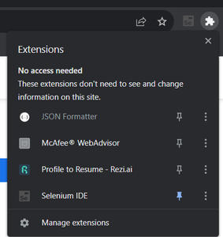

  - Maintenant, cliquez sur Selenium IDE pour commencer à travailler avec Selenium IDE. Vous pouvez désormais enregistrer un nouveau test dans un nouveau projet, ouvrir un projet existant et également créer un nouveau projet.

   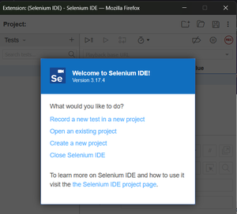

## Création des testes simples
Nous allons effectuer un test simple de bout en bout avec Selenium IDE. Pour celà suivez les étapes suivantes : 

  1. Ouvrez l'extension Selenium IDE installée pour accéder à son interface par défaut. Ensuite, cliquez sur "Créer un nouveau projet".

    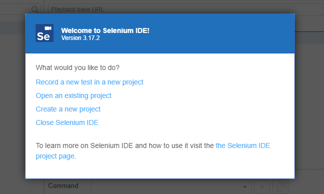

  2.  La prochaine étape consiste à attribuer un nom à votre projet. Vous pouvez donner n'importe quel nom qui reflète l'identité de votre projet.

     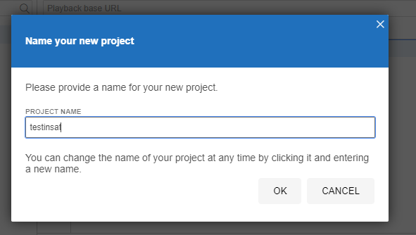

  3. Pour commencer le processus de création d'un cas de test pour votre site web, ajoutez un nouveau cas de test en cliquant sur le symbole ‘+’ dans l'onglet "Tests" et nommez votre test.

      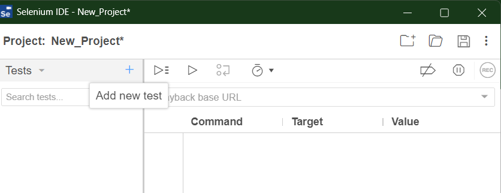

  4.  Une URL de base de lecture est nécessaire pour exécuter votre cas de test ; votre cas de test commencera à partir de l'URL que vous fournirez. Ajoutez une URL de base de lecture, par exemple https://www.[geeksforgeeks.org](https://insat.rnu.tn/)/, dans l'onglet tel qu'illustré dans l'image ci-dessous.

     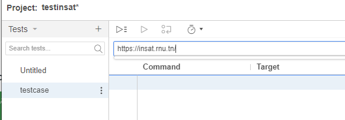

  5.  Pour commencer l'enregistrement de votre cas de test, cliquez sur le bouton d'enregistrement disponible. Il capturera chaque interaction avec l'application web en temps réel.

      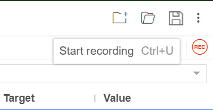

  6.  Visitez le site web que vous souhaitez tester et effectuez les actions spécifiques que vous souhaitez intégrer dans votre cas de test. Selenium IDE enregistrera ces actions en tant qu'étapes dans votre cas de test.

  7.  Une fois que vous avez terminé vos interactions, cliquez sur le bouton "Arrêter l'enregistrement" dans Selenium IDE.

     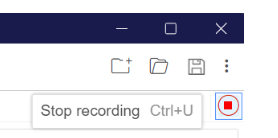
  
  8. Cliquez sur le bouton "Exécuter le test actuel" pour exécuter votre cas de test ; il rejouera les actions que vous avez effectuées. Observez les interactions et vous pouvez identifier tout problème lors de l'exécution du test.

      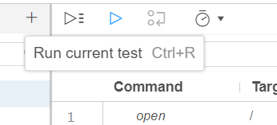

  9. Vous pouvez facilement évaluer le résumé de votre cas de test en vérifiant la section "log" ci-dessous, ce qui vous aidera à identifier si des étapes ont échoué ou réussi.

    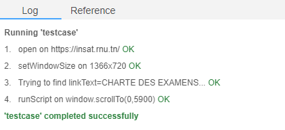

  10. Cliquez sur les trois points situés sur le côté droit de votre test, puis sélectionnez "Exporter" pour exporter votre cas de test dans le langage de votre choix, afin de pouvoir l'utiliser avec d'autres outils et cadres Selenium pour diverses fins de test et d'automatisation.

     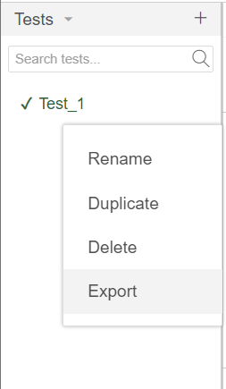
  
    Il vous proposera des options pour exporter votre cas de test dans les langages donnés. Vous pouvez choisir n'importe quel langage parmi ceux proposés pour exporter votre cas de test.

    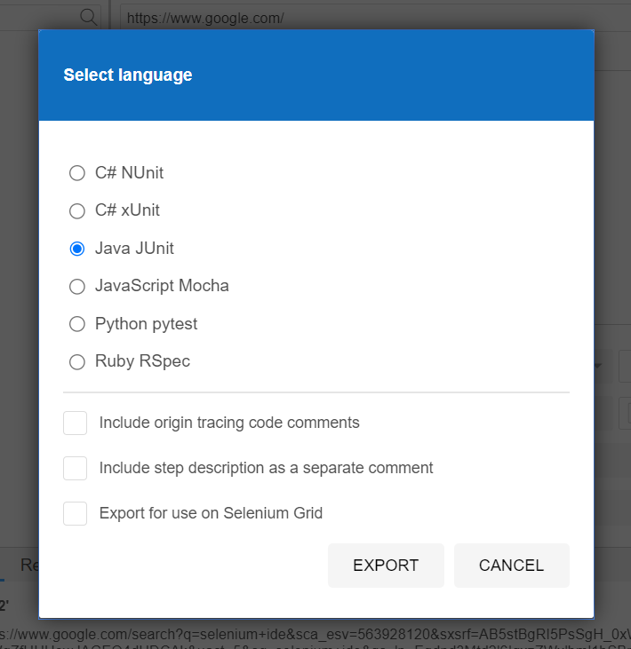

## Travail à rendre 
!!! Exercice
    L'objectif est d'utiliser Selenium IDE pour automatiser le test de la page [suivante](assets/hello.html)

    1. Ouvrez Selenium IDE.

    2. Créez un nouveau test dans Selenium IDE.

    3. Enregistrez un nouveau scénario de test en utilisant l'outil d'enregistrement.

    4. Exécutez le test pour vérifier son bon fonctionnement initial.

    5. Modifiez le script pour changer la valeur du nom d'utilisateur enregistré dans l'enregistrement précédent.

    6. Ajoutez une nouvelle commande "Assert Text" pour vérifier que le message affiché est correct après avoir cliqué sur le bouton "Bonjour".

    7. Exécutez le script de test pour deux cas : un cas où l'assertion réussit et un cas où l'assertion échoue, en modifiant le nom d'utilisateur pour chaque cas.

    8. Analysez les résultats et identifiez les écarts entre les résultats attendus et réels.

    9. Faites des ajustements au script si nécessaire pour corriger les erreurs ou les échecs de l'assertion.

!!! Exercice
    L'objectif est d'utiliser Selenium IDE pour automatiser le test de la calculatrice [suivante](assets/calc.html)

    1. Utilisez Selenium IDE pour enregistrer une série d'actions qui testent différentes fonctionnalités de la calculatrice, en vous assurant de couvrir les cas suivants :
    2. Testez l'addition de deux nombres.
    3. Testez la soustraction de deux nombres.
    4. Testez la multiplication de deux nombres.
    5. Testez la division de deux nombres.
    6. Testez la division par zéro et assurez-vous que le message d'erreur approprié est affiché le cas échéant.
    7. Testez des cas de valeurs nulles ou vides dans les champs de saisie.
    8. Ajoutez des assertions pour vérifier que les résultats affichés sont corrects.
    9. Organisez vos tests en suites logiques pour une meilleure gestion.
    10. Exécutez vos tests pour vérifier qu'ils passent tous avec succès.

!!! Exercice
    1. Accédez au site [demoblaze](https://www.demoblaze.com/) dans votre navigateur. Ce site propose une gamme de produits fictifs pour simuler un magasin en ligne.

    2. Utilisez Selenium IDE pour enregistrer une série d'actions qui testent différentes fonctionnalités du site, en vous assurant de couvrir les cas suivants :
    3. Parcourez les différentes catégories de produits disponibles sur le site.
    4. Ajoutez un produit au panier.
    5. Accédez au panier, vérifiez les articles ajoutés et supprimez-en si nécessaire.
    6. Vérifiez la confirmation de la commande après le paiement.   
    7. Testez la fonction de recherche pour trouver un produit spécifique.
    8. Explorez les pages supplémentaires telles que la page d'accueil, la page "À propos", etc.
    9. Utilisez des variables pour stocker des données telles que les noms de produits, les adresses de livraison, etc., afin de rendre vos tests plus dynamiques et réutilisables.
    10. Ajoutez des assertions pour vérifier que les actions effectuées ont produit les résultats attendus.
    11. Exécutez vos tests pour vérifier qu'ils passent tous avec succès.

